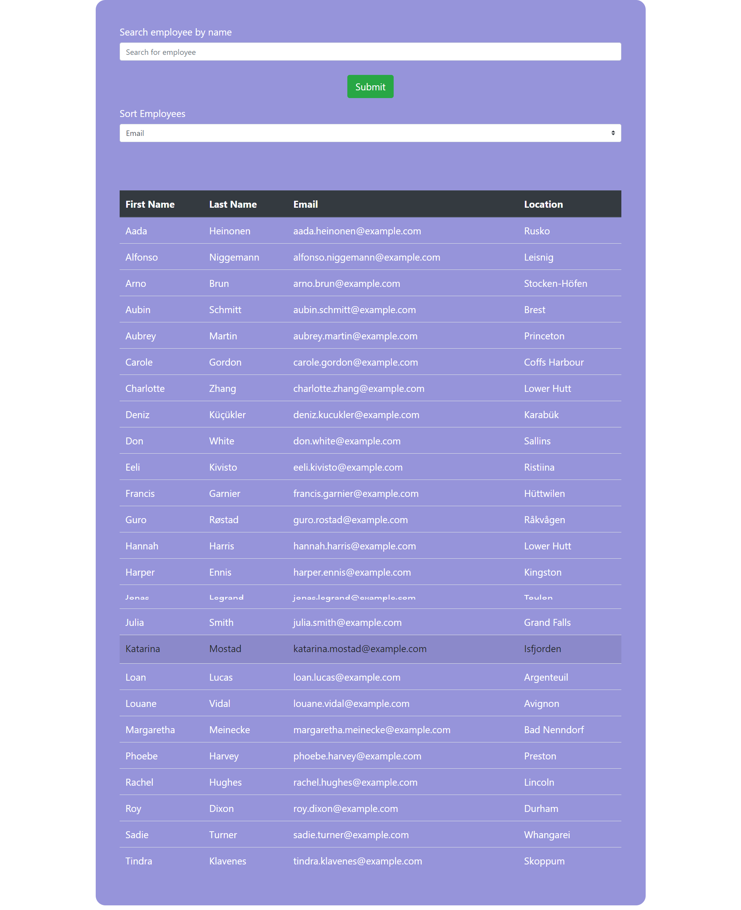

# Employee Directory

# Application Does:
* This is a react application of Employee details.It is helpful to view the employee details in a table,to get particular employee details and to sort employees details.So,user has quick access to employee details.Use axios to get information from randomuser API.

# Technologies used:
* React , bootstrap, axios, css

# Sample web page

# Github repository
 https://github.com/vsatyakavya/EmployeeDirectory   

 
 
# Github Page
https://vsatyakavya.github.io/EmployeeDirectory/

# contact Information
satyakavya24@gmail.com

@copyright 2020
